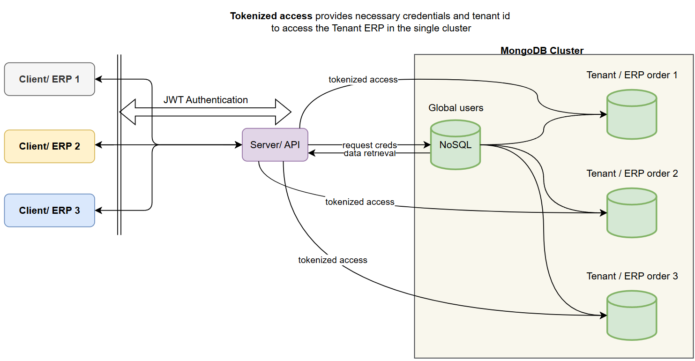

# 🍽️ Multi-Tenant Food & Beverage ERP with Subscription-Based Admin Signup

This is a **Multi-Tenant ERP** for Food & Beverage businesses. It allows
**Admins to register their business via a subscription**, manage users, and
handle orders.

---

## **📜 Architecture Overview**

The system follows a **Multi-Tenant SaaS (Software-as-a-Service) Architecture**:

- **Separation of Tenants:** Each business has its own `tenantId`, ensuring
  **data isolation**.
- **Role-Based Access Control (RBAC):**
  - **Admin:** Registers the business (via payment), manages users & orders.
  - **Staff:** Can only manage orders within their business.
- **Payment Integration with Stripe:** Admins must subscribe before registering.



### **🛠️ Tech Stack**

| Technology             | Purpose                         |
| ---------------------- | ------------------------------- |
| **Node.js + Express**  | Backend API                     |
| **TypeScript**         | Type Safety & Maintainability   |
| **MongoDB + Mongoose** | Database (Multi-Tenant Support) |
| **JWT Authentication** | Secure User Sessions            |
| **Stripe API**         | Subscription-based Admin Signup |

---

## **🚀 Features**

✅ **Admin Subscription Model** (Paywall for Business Registration)\
✅ **Multi-Tenant Architecture** (Each business is isolated)\
✅ **Role-Based Access (Admin, Staff)**\
✅ **JWT Authentication & Authorization**\
✅ **Order Management Per Tenant**\
✅ **Stripe Webhook to Confirm Payments**

---

## **🔧 Setup & Installation**

### **1️⃣ Clone the Repository**

```sh
git clone https://github.com/Iktisad/multi_tenant_food_ERP.git
cd multi_tenant_food_ERP/backend
```

### **2️⃣ Install Dependencies**

```sh
npm install
```

### **3️⃣ Configure Environment Variables**

Create a `.env` file in the root directory and add:

```ini
PORT=5000
MONGO_URI=mongodb://localhost:27017/fooderp
JWT_SECRET=your_secret_key
STRIPE_SECRET_KEY=your_stripe_secret_key
STRIPE_WEBHOOK_SECRET=your_stripe_webhook_secret
FRONTEND_URL=http://localhost:3000
```

### **4️⃣🔧 Setup MongoDB Community Server Locally**

This application requires **MongoDB Community Server** running locally. Follow
these steps to install and start MongoDB:

### **5️⃣ Install MongoDB Community Server**

- **Download & Install** from the official MongoDB website:\
  🔗
  [MongoDB Community Server Download](https://www.mongodb.com/try/download/community)

### **6️⃣ Start MongoDB Locally**

Once installed, start the MongoDB server by running Mongo Compass or

```sh
mongod --dbpath=/data/db
```

- If `/data/db` does not exist, create it:

```sh
mkdir -p /data/db
```

- Ensure that **MongoDB is running** before starting the application.

---

### **7️⃣ Run the Application**

```sh
npm run start:dev
```

---

## **🛠️ API Endpoints**

### **👤 User Authentication**

| Endpoint             | Method | Description                       |
| -------------------- | ------ | --------------------------------- |
| `/api/auth/register` | `POST` | Register a new user (Admin/Staff) |
| `/api/auth/login`    | `POST` | Login and get JWT token           |

### **📦 Order Management**

| Endpoint      | Method | Description                     |
| ------------- | ------ | ------------------------------- |
| `/api/orders` | `POST` | Create an order (Authenticated) |
| `/api/orders` | `GET`  | Get all orders (Authenticated)  |

### **👨‍💼 Admin Subscription** (Not Implemented)

| Endpoint               | Method | Description                               |
| ---------------------- | ------ | ----------------------------------------- |
| `/api/admin/subscribe` | `POST` | Initiate Stripe Checkout for Admin Signup |
| `/api/admin/webhook`   | `POST` | Stripe Webhook for Payment Confirmation   |

### **📩 User Invitation System**

| Endpoint                    | Method | Description                    |
| --------------------------- | ------ | ------------------------------ |
| `/api/invite/invite`        | `POST` | Admin invites a new Staff user |
| `/api/invite/accept-invite` | `POST` | Staff accepts an invitation    |

---

## **🔹 Database Schema**

### **User Model (`users` Collection)**

```ts
{
  _id: ObjectId,
  name: string,
  email: string,
  password: string,
  role: "Admin" | "Staff",
  tenantId: string
}
```

### **Tenant Model (`tenants` Collection)**

```ts
{
  _id: ObjectId,
  tenantId: string, // Auto-generated UUID
  name: string, // Unique Business Name
  createdAt: Date
  updatedAt: Date
}
```

### **Order Model (`orders` Collection)**

```ts
{
  _id: ObjectId,
  tenantId: string,
  customerName: string,
  items: [{ name: string, quantity: number }],
  totalPrice: number
}
```

### **Invitation Model (`invitations` Collection)**

```ts
{
  _id: ObjectId,
  email: string,
  tenantId: string,
  role: "Staff",
  token: string, // Unique invitation token
  expiresAt: Date // Expiry date for the invite
}
```
